# Data Flow Diagram (DFD) - Himsog Healthcare Platform

A unified Data Flow Diagram showing the complete system flow for the Himsog Healthcare Geolocation Platform.

## DFD Symbol Legend

| Symbol | Mermaid Shape | Represents |
|--------|---------------|------------|
| Rectangle | `[Entity]` | External Entity (User, Provider, Admin) |
| Rounded | `([Process])` | Process (transforms data) |
| Cylinder | `[(Database)]` | Data Store |
| Arrow | `-->` | Data Flow |

---

## Complete System Data Flow Diagram

```mermaid
flowchart TB
    %% ==================== EXTERNAL ENTITIES ====================
    USER["👤 USER (Patient)"]
    PROVIDER["🏥 PROVIDER (Healthcare)"]
    ADMIN["🔐 ADMIN (Administrator)"]

    %% ==================== EXTERNAL SERVICES ====================
    GOOGLE["🔑 Google OAuth"]
    EMAIL["📧 Resend Email Service"]
    STORAGE["☁️ Supabase Storage"]
    REALTIME["⚡ Supabase Realtime"]
    MAPBOX["🗺️ Mapbox Service"]

    %% ==================== PROCESSES ====================
    P1(("1.0<br/>AUTHENTICATION<br/>SYSTEM"))
    P2(("2.0<br/>PROVIDER<br/>DISCOVERY"))
    P3(("3.0<br/>PROVIDER<br/>MANAGEMENT"))
    P4(("4.0<br/>APPOINTMENT<br/>BOOKING"))
    P5(("5.0<br/>APPOINTMENT<br/>MANAGEMENT"))
    P6(("6.0<br/>MESSAGING<br/>SYSTEM"))
    P7(("7.0<br/>REVIEW<br/>SYSTEM"))
    P8(("8.0<br/>ADMIN<br/>MANAGEMENT"))

    %% ==================== DATA STORES ====================
    D1[("D1: USER ACCOUNTS<br/>─────────────<br/>id, name, email,<br/>role, image,<br/>emailVerified")]

    D2[("D2: PROVIDER DATABASE<br/>─────────────<br/>id, healthcareName,<br/>status, category,<br/>address, coordinates")]

    D3[("D3: APPOINTMENT DATABASE<br/>─────────────<br/>id, appointmentNumber,<br/>status, totalPrice,<br/>startTime, endTime")]

    D4[("D4: CONVERSATION & MESSAGES<br/>─────────────<br/>conversationId, senderId,<br/>content, status,<br/>createdAt")]

    D5[("D5: REVIEW DATABASE<br/>─────────────<br/>id, rating, comment,<br/>providerResponse,<br/>isAnonymous")]

    D6[("D6: CATEGORY DATABASE<br/>─────────────<br/>id, name, slug,<br/>icon, isActive")]

    D7[("D7: SERVICE & SCHEDULE<br/>─────────────<br/>services, operatingHours,<br/>breakTimes, documents")]

    D8[("D8: NOTIFICATIONS & AUDIT<br/>─────────────<br/>notifications, auditLogs,<br/>sessions")]

    %% ==================== USER FLOWS ====================
    USER -->|"1. Email/Password<br/>or Google OAuth"| P1
    P1 -->|"Session Token<br/>Role-based Redirect"| USER

    USER -->|"2. Search Query<br/>Location, Filters"| P2
    P2 -->|"Provider Listings<br/>with Distance & Rating"| USER

    USER -->|"3. Selected Services<br/>Date/Time, Patient Info"| P4
    P4 -->|"Appointment Confirmation<br/>with Booking Number"| USER

    USER -->|"4. Message Content"| P6
    P6 -->|"Real-time Messages"| USER

    USER -->|"5. Rating & Comment<br/>Category Ratings"| P7
    P7 -->|"Review Published"| USER

    %% ==================== PROVIDER FLOWS ====================
    PROVIDER -->|"1. Credentials"| P1
    P1 -->|"Session Token<br/>Redirect to Dashboard"| PROVIDER

    PROVIDER -->|"2. Profile, Services<br/>Schedule, Documents"| P3
    P3 -->|"Profile Created<br/>(Status: PENDING)"| PROVIDER

    PROVIDER -->|"3. Confirm/Cancel<br/>Reschedule"| P5
    P5 -->|"Updated Appointments<br/>Analytics & Stats"| PROVIDER

    PROVIDER -->|"4. Message Content"| P6
    P6 -->|"Real-time Messages"| PROVIDER

    PROVIDER -->|"5. Response Text<br/>to Reviews"| P7
    P7 -->|"Response Published"| PROVIDER

    %% ==================== ADMIN FLOWS ====================
    ADMIN -->|"1. Credentials"| P1
    P1 -->|"Session Token<br/>Redirect to Admin"| ADMIN

    ADMIN -->|"2. Verification Decision<br/>(VERIFY/REJECT)"| P8
    P8 -->|"Updated Status<br/>Platform Metrics"| ADMIN

    ADMIN -->|"3. Category Data<br/>User Management"| P8
    P8 -->|"Audit Logs<br/>Reports"| ADMIN

    %% ==================== PROCESS TO DATA STORE ====================
    P1 <-->|"Validate/Create<br/>User & Session"| D1

    P2 <-->|"Query Verified<br/>Providers"| D2
    P2 <-->|"Get Services<br/>& Ratings"| D7
    P2 <-->|"Get Reviews"| D5

    P3 -->|"Create Provider<br/>Profile"| D2
    P3 -->|"Create Services<br/>& Schedule"| D7

    P4 <-->|"Check Availability<br/>Create Booking"| D3
    P4 <-->|"Validate Services<br/>& Schedule"| D7
    P4 -->|"Send Notifications"| D8

    P5 <-->|"Update Status<br/>Get Appointments"| D3
    P5 -->|"Log Activities"| D8

    P6 <-->|"Store & Retrieve<br/>Messages"| D4

    P7 <-->|"Create/Update<br/>Reviews"| D5
    P7 -->|"Update Provider<br/>Average Rating"| D2

    P8 <-->|"Update Provider<br/>Status"| D2
    P8 <-->|"Manage Categories"| D6
    P8 -->|"Log Admin<br/>Actions"| D8

    %% ==================== EXTERNAL SERVICE CONNECTIONS ====================
    P1 <-->|"OAuth Authentication"| GOOGLE

    P2 <-->|"Geocoding &<br/>Distance Calculation"| MAPBOX

    P3 -->|"Upload Documents<br/>& Cover Photos"| STORAGE

    P4 -->|"Booking Confirmation<br/>Email"| EMAIL

    P6 <-->|"Broadcast<br/>Real-time Events"| REALTIME

    P8 -->|"Verification Status<br/>Email"| EMAIL

    %% ==================== STYLING ====================
    classDef entity fill:#e1f5fe,stroke:#01579b,stroke-width:2px
    classDef process fill:#fff3e0,stroke:#e65100,stroke-width:2px
    classDef datastore fill:#e8f5e9,stroke:#2e7d32,stroke-width:2px
    classDef external fill:#fce4ec,stroke:#880e4f,stroke-width:2px

    class USER,PROVIDER,ADMIN entity
    class P1,P2,P3,P4,P5,P6,P7,P8 process
    class D1,D2,D3,D4,D5,D6,D7,D8 datastore
    class GOOGLE,EMAIL,STORAGE,REALTIME,MAPBOX external
```

---

## Data Flow Summary Table

### External Entities → Processes

| From | To Process | Data Flow |
|------|------------|-----------|
| USER | 1.0 Authentication | Email/Password, Google OAuth credentials |
| USER | 2.0 Provider Discovery | Search query, location, category, insurance filters |
| USER | 4.0 Appointment Booking | Selected services, date/time, patient details, notes |
| USER | 6.0 Messaging | Message content, conversation ID |
| USER | 7.0 Review | Rating (1-5), comment, category ratings, anonymous flag |
| PROVIDER | 1.0 Authentication | Credentials |
| PROVIDER | 3.0 Provider Management | Profile info, services, schedule, documents |
| PROVIDER | 5.0 Appointment Management | Confirm/Cancel/Reschedule decisions |
| PROVIDER | 6.0 Messaging | Message content, conversation ID |
| PROVIDER | 7.0 Review | Response text to patient reviews |
| ADMIN | 1.0 Authentication | Credentials |
| ADMIN | 8.0 Admin Management | Verification decisions, category data, user actions |

### Processes → External Entities

| From Process | To | Data Flow |
|--------------|-----|-----------|
| 1.0 Authentication | ALL USERS | Session token, role-based redirect URL |
| 2.0 Provider Discovery | USER | Provider listings (name, rating, distance, services) |
| 4.0 Appointment Booking | USER | Confirmation with appointment number, total price |
| 5.0 Appointment Management | PROVIDER | Appointment list, analytics, dashboard KPIs |
| 6.0 Messaging | USER/PROVIDER | Real-time message delivery |
| 7.0 Review | USER | Published review confirmation |
| 7.0 Review | PROVIDER | Review list with ratings |
| 8.0 Admin Management | ADMIN | Platform metrics, audit logs, provider statuses |

### Processes ↔ Data Stores

| Process | Data Store | Operation |
|---------|------------|-----------|
| 1.0 Authentication | D1: User Accounts | Validate credentials, create user, manage sessions |
| 2.0 Provider Discovery | D2: Provider Database | Query verified providers with filters |
| 2.0 Provider Discovery | D5: Review Database | Get provider ratings and reviews |
| 2.0 Provider Discovery | D7: Service & Schedule | Get services, operating hours |
| 3.0 Provider Management | D2: Provider Database | Create provider profile (PENDING status) |
| 3.0 Provider Management | D7: Service & Schedule | Create services, operating hours, documents |
| 4.0 Appointment Booking | D3: Appointment Database | Check availability, create appointment |
| 4.0 Appointment Booking | D7: Service & Schedule | Validate services and schedule |
| 4.0 Appointment Booking | D8: Notifications | Send booking notifications |
| 5.0 Appointment Management | D3: Appointment Database | Update status, get appointments |
| 6.0 Messaging | D4: Conversations & Messages | Store and retrieve messages |
| 7.0 Review | D5: Review Database | Create review, add provider response |
| 7.0 Review | D2: Provider Database | Update provider average rating |
| 8.0 Admin Management | D2: Provider Database | Update provider verification status |
| 8.0 Admin Management | D6: Category Database | CRUD category operations |
| 8.0 Admin Management | D8: Notifications & Audit | Log admin actions |

### Processes ↔ External Services

| Process | External Service | Data Flow |
|---------|-----------------|-----------|
| 1.0 Authentication | Google OAuth | OAuth token exchange |
| 2.0 Provider Discovery | Mapbox | Geocoding, distance calculation |
| 3.0 Provider Management | Supabase Storage | Upload documents, cover photos |
| 4.0 Appointment Booking | Resend Email | Booking confirmation email |
| 6.0 Messaging | Supabase Realtime | Broadcast real-time message events |
| 8.0 Admin Management | Resend Email | Provider verification status email |

---

## Data Store Dictionary

| ID | Name | Key Fields | Description |
|----|------|------------|-------------|
| D1 | User Accounts | id, name, email, role, image, emailVerified, banned, createdAt | All registered users (USER, PROVIDER, ADMIN roles) |
| D2 | Provider Database | id, userId, healthcareName, description, status, category, address, city, province, latitude, longitude, coverPhoto, verifiedAt | Healthcare provider profiles and verification status |
| D3 | Appointment Database | id, appointmentNumber, userId, providerId, startTime, endTime, status, totalPrice, patientName, patientEmail, patientPhone, notes, cancelReason | All booking records with status tracking |
| D4 | Conversations & Messages | conversationId, user1Id, user2Id, senderId, content, status (SENT/DELIVERED/READ), createdAt | Chat conversations and message history |
| D5 | Review Database | id, userId, providerId, appointmentId, rating, comment, isAnonymous, providerResponse, responseAt, categoryRatings | Patient reviews and provider responses |
| D6 | Category Database | id, name, slug, description, icon, color, sortOrder, isActive | Healthcare service categories |
| D7 | Service & Schedule | services (name, price, duration, pricingModel), operatingHours (dayOfWeek, startTime, endTime), breakTimes, documents | Provider services, schedules, and uploaded documents |
| D8 | Notifications & Audit | notifications (userId, type, title, message, isRead), auditLogs (action, entityType, userId, details), sessions | System notifications, admin audit trail, user sessions |

---

## Process Descriptions

| # | Process | Description | Triggered By |
|---|---------|-------------|--------------|
| 1.0 | Authentication System | Validates user credentials (email/password or Google OAuth), creates sessions, determines role-based redirects | User login/registration |
| 2.0 | Provider Discovery | Searches and filters verified healthcare providers by location, category, insurance; calculates distance from user | User search action |
| 3.0 | Provider Management | Handles provider onboarding (4-step registration), profile updates, service/schedule management | Provider registration/updates |
| 4.0 | Appointment Booking | Checks provider availability, validates booking data, calculates total price, creates appointment, sends notifications | User booking action |
| 5.0 | Appointment Management | Allows providers to confirm, cancel, reschedule appointments; provides analytics and statistics | Provider appointment actions |
| 6.0 | Messaging System | Creates conversations, stores messages, broadcasts real-time events via Supabase Realtime | User/Provider sends message |
| 7.0 | Review System | Validates review eligibility (completed appointment), creates reviews, calculates provider ratings, stores provider responses | User submits review |
| 8.0 | Admin Management | Verifies/rejects providers, manages categories, handles user management, generates platform reports, logs audit trail | Admin actions |
